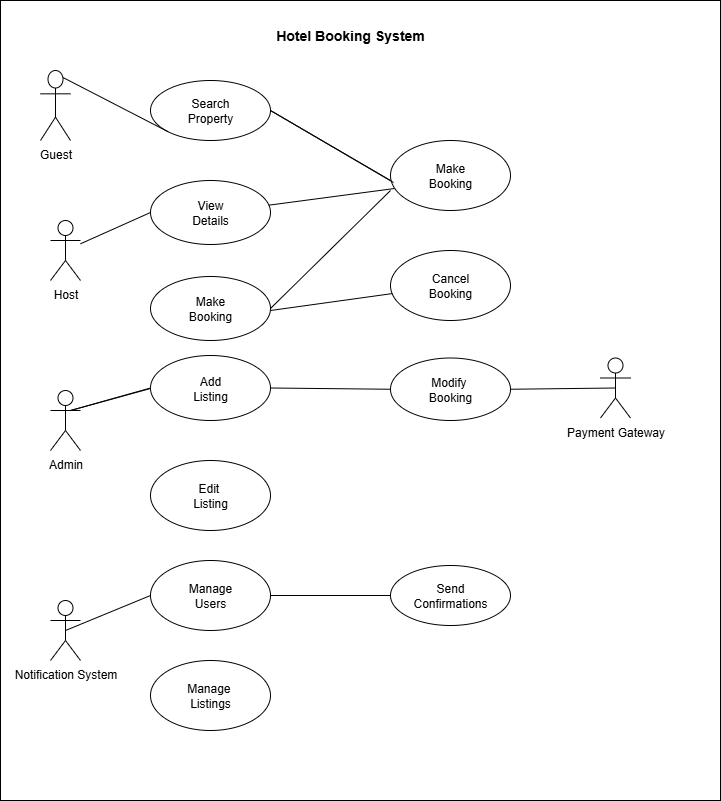

# Requirement Analysis in Software Development

This project focuses on crafting a comprehensive foundation for software development by documenting, analyzing, and structuring requirements. Through a series of well-defined tasks,a detailed blueprint of the requirement analysis phase for a booking management system will be created. This project simulates a real-world development scenario, emphasizing clarity, precision, and structure in defining requirements to set the stage for successful project execution.

# What is Requirement Analysis?

Requirement analysis is a critical phase in Software Development Lifecycle (SDLC) where the project team gathers, analyzes, and defines the requirements of the software product to be developed. This process ensures that all stakeholders have a clear and mutual understanding of what the system should do and how it should perform.

# Why is Requirement Analysis Important?

- Helps in understanding what stakeholders expect from the software hence reducing ambiguity
- Provides a solid foundation for designing and developing the system
- It helps in clearlyy defining the scope of the project hence preventing scope creep
- Facilitates accurate estimation of project cost, resources, and time
- Ensures that the final product meets the specified requirements, leading to higher customer satisfaction

# Key Activities in Requirement Analysis

## Requirement Gathering
- Engage with stakeholders to collect initial requirements.
- Use various techniques like interviews, surveys, and workshops.

## Requirement Elicitation
- Refine and elaborate on the gathered requirements.
- Use techniques like brainstorming, focus groups, and prototyping.

## Requirement Documentation
- Document the requirements in a detailed and structured format.
- Use requirement specification documents, user stories, and use cases.

## Requirement Analysis and Modeling
- Analyze and prioritize the requirements.
- Create models to visualize and understand the requirements.

## Requirement Validation
- Review and validate the requirements with stakeholders.
- Define acceptance criteria and ensure traceability.

# Types of Requirements
## 1. Functional Requirement Analysis
Functional requirement analysis focuses on what the system should do.
It covers features, functions, and behaviors.

Example: User Authentication,property search,booking system,user registration

"The system shall allow users to log in with a username and password."

## 2. Non-Functional Requirement Analysis
Non-Functional requirement analysis focuses on how the system should perform.
Includes performance, security, usability, reliability, scalability, etc.

Example: "The system should support 10,000 concurrent users."

# Use Case Diagrams

A **Use Case Diagram** is a UML diagram used in requirement analysis to capture the functional requirements of a system.  
It visually shows how **actors** (users or external systems) interact with the system through **use cases** (functionalities).  

## Benefits of Use Case Diagrams
- Provide a high-level view of system functionality.
- Identify external users and their interactions with the system.
- Clarify system boundaries and scope.
- Improve communication between developers, designers, and stakeholders.
- Serve as a foundation for creating detailed requirements and test cases.

## Booking System Use Case Diagram

Below is an example of a use case diagram for the **Booking System**:

# Acceptance Criteria

Acceptance criteria (AC) are **specific conditions that a feature or user story must satisfy to be considered complete**. They play a critical role in requirement analysis by:

## Importance of Acceptance Criteria
- Providing **clarity and shared understanding** among stakeholders, developers, and testers.
- Defining **what “done” looks like**, reducing ambiguity.
- Guiding **test case creation** and ensuring quality assurance.
- Helping **manage scope** and prevent feature creep.
- Ensuring that delivered features **meet user expectations**, improving customer satisfaction.

## Example: Checkout Feature in a Booking Management System

**Acceptance Criteria:**

1. **Cart Review**
   - Users must be able to view all selected bookings in the cart.
   - Users can remove or modify bookings before checkout.

2. **Payment Process**
   - Users can select a payment method (credit/debit card or online payment).
   - Payment must be successfully processed before confirmation.
   - Users are notified of payment failures with clear error messages.

3. **Booking Confirmation**
   - A confirmation message or email is sent after successful checkout.
   - Users can view a summary of their booking and payment details.
